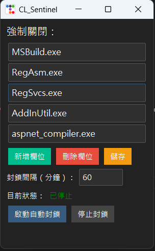

# ChroLens_Sentinel

**定時關閉並封鎖指定程式，避免它們在背景偷偷運行。**  
可自訂清單與間隔，啟動後自動巡檢，停用也一鍵搞定。

---

## 📜 起因
前兩天自己手殘去按到更新並重開機，導致 Windows 版本更新。  
結果遇到一個奇怪的 Bug —— 工作管理員中那幾個程式會無限增長，一直重複執行，  
CPU 使用率就會慢慢撐到 **100%**。

小丑終究是我自己 🤡

起初寫了個 `.bat` 來跑，但成效不彰，最後還是寫成 **Python** 打包成 `.exe`。  

---

## ✨ 功能特色
- **可自訂封鎖清單** — 欄位中的檔案名稱可以修改。
- **可增減監控項目** — 欄位可自由增減。
- **定時巡檢** — 重複執行時間可自訂。
- **持續守護** — 啟動後自動監控並封鎖目標程式。
- **一鍵停用** — 想要解除封鎖，直接按下按鈕即可。

---

## ⚠️ 注意
這是一個相對冷門的工具，正常情況下你可能永遠不會需要它。  
但一旦遇到類似 **Windows 更新後的背景程式無限啟動 Bug**，它或許能救你一命。

> 希望大家不要遇到比較好 🙏

---
